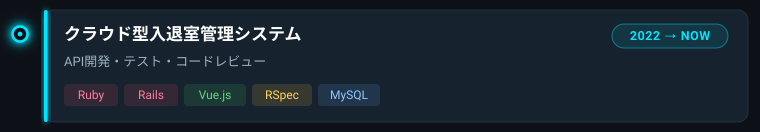
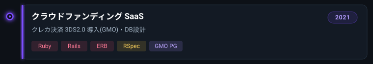
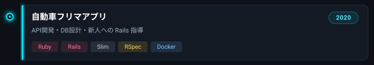
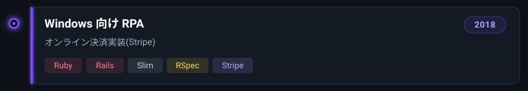
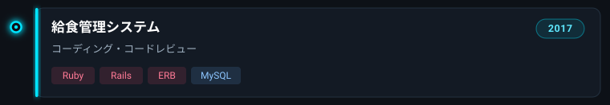
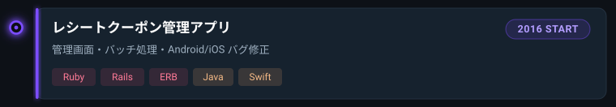

<!-- ============ HEADER ============ -->

  

  

  <strong>小崎 薫</strong>（こざき かおる）

<!-- ============ ABOUT ============ -->
## 👋 About

**Ruby / Rails を中心に約9年**、Web アプリ・API 開発に携わってきたバックエンドエンジニアです。
クレジットカード**決済の導入（3DS2.0 / Stripe / GMO PG）**、**RSpec によるテスト整備**、**コードレビューや新人エンジニアへの Rails 指導**を主戦場にしてきました。
個人で**軽めの開発案件（API・Web アプリ開発、決済連携、保守・リファクタ）**を承っています。お気軽にご相談ください。

<!-- ============ SKILLS ============ -->
## 🛠 Skills

<!--
  ハイブリッド構成:
  - 主要スタックは skillicons.dev（theme=dark）のアイコングリッドで表示（ゲーミング映え＆行数削減）
  - skillicons 未収録（RSpec / Stripe / GMO PG / Jira / Trello / Backlog / Redmine / Esa / Xcode）は
    shields.io flat-square で補完（色は style-guide の技術カテゴリ色に準拠）
-->

**言語 / フレームワーク — Languages & Frameworks**

**DB / インフラ — Database & Infra**

**テスト / 決済 — Testing & Payments**

-A78BFA?style=flat-square&labelColor=131A24)

**ツール / Tools**

**モバイル / Mobile**

<!-- ============ CAREER ============ -->
## ⚔ 経歴 / CAREER

> Ruby / Rails を軸にした約9年の歩み（新しい順）。各案件を**クリックで開く**と担当業務の詳細が出ます。

<!--
  ネオンの見た目は assets/career/*.svg（外部 SVG 画像）で表現。
  GitHub の Markdown は inline CSS / <style> / <script> をサニタイズするため、
   で参照する外部 SVG なら glow(filter) も配色も生きる。
  各案件は details / summary 要素で開閉。summary 内の img がカード（閉じた状態）。
-->

  

    
  

  **担当業務**
  - Ruby / Rails での API コーディング
  - Vue.js 製画面の保守
  - RSpec でのテストコーディング
  - API 設計書などのドキュメント作成
  - コードレビュー

  

    
  

  **担当業務**
  - Ruby / Rails / ERB でのコーディング
  - クレジットカード決済の 3DS2.0 導入（GMO）
  - RSpec でのテストコーディング
  - 新規機能開発に伴う DB テーブル設計
  - テスト仕様書などのドキュメント作成
  - コードレビュー

  

    
  

  **担当業務**
  - Ruby / Rails での API コーディング
  - RSpec でのテストコーディング
  - 新規機能開発に伴う DB テーブル設計
  - IF仕様書・結合テスト仕様書などのドキュメント作成
  - 新規参画者への Ruby / Rails コーディング指導
  - API ソースのコードレビュー

  

    
  

  **担当業務**
  - Ruby / Rails での API ソースコーディング
  - RSpec でのテストコーディング
  - オンライン決済機能の実装
  - IF仕様書・画面などのドキュメント作成

  

    
  

  **担当業務**
  - Ruby / Rails / ERB でのコーディング
  - 他 PG 2名のコードレビュー
  - 画面仕様書・テスト仕様書などのドキュメント作成

  

    
  

  **担当業務**
  - Ruby / Rails / ERB での管理画面コーディング
  - 各種バッチタスク（ランキング集計など）作成
  - Android・iOS のバグ修正
  - PO やデザイナーからの要求分析
  - 運用マニュアル・テスト仕様書などのドキュメント作成

<!-- ============ 受けられる案件 ============ -->
## 💼 受けられる案件

こんなお仕事をお引き受けできます。

- 🚀 **Rails での API・Web アプリ開発** — 新規開発から機能追加まで
- 💳 **クレジットカード決済の導入** — 3DS2.0 / Stripe / GMO PG
- 🔧 **既存システムの保守・リファクタリング** — レガシー Rails の改善も
- ✅ **RSpec によるテスト整備** — テストが手薄なプロジェクトの底上げ
- 👀 **コードレビュー** — 品質・可読性・設計の観点でレビュー
- 🌱 **新人エンジニアの Rails 指導・サポート**

> 想定の規模感：個人事業主〜中小企業の案件、他エンジニアからの二次受けなど。まずはご相談ベースで歓迎です。

<!-- ============ GITHUB STATS ============ -->
## 📊 GitHub Stats

  
  

<!-- ============ CONTACT ============ -->
## 📫 Contact

<!--
  必要に応じて、以下のような SNS / 連絡手段のバッジを追加してください（任意）。
  確定情報がないため、現時点ではプレースホルダーも置いていません。
  例）X(Twitter), Zenn, Qiita, Wantedly, ポートフォリオサイト など
  - X(Twitter): https://twitter.com/＜ユーザー名＞
  - Zenn:       https://zenn.dev/＜ユーザー名＞
-->

  

