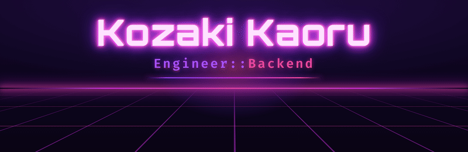

<!-- ============ HEADER ============ -->

  

<!-- ============ ABOUT ============ -->
## 👋 About

Ruby / Railsを中心にWebアプリ・APIの開発をしています。
2016年に新卒として開発会社に入社し、5年現場を経験した後、2021年からフリーランスでお仕事をいただいてご飯を食べています🍚

Ruby一本で生きてきましたが、AIの発達で出来ることの幅が大幅に増えたため、現在はフルスタックエンジニアにステップアップできるように日々精進しております。

開発のご相談がありましたら、お気軽にお問い合わせください。

  

<!-- ============ SKILLS ============ -->
## 🛠 Skills

**言語 / フレームワーク — Languages &amp; Frameworks**

**DB / インフラ — Database &amp; Infra**

**テスト / 決済 — Testing &amp; Payments**

-2C5DA8?style=flat-square&labelColor=160a22)

**ツール / Tools**

**モバイル / Mobile**

  

<!-- ============ 受けられる案件 ============ -->
## 💼 What I Can Do

**Ruby / Rails の案件なら、なんでもやります。**

- 🏢 コーポレートサイト
- ⚙️ 業務システム
- 🌐 Web アプリケーション

開発まわりは Claude Code もフル活用するので、対応できる幅は広めです。
やりたいのは「手を動かす開発」なので、新規開発も既存システムの改修も歓迎。
まずはお気軽にご相談ください。

> ⏰ 現在は平日日中にメインの案件があるため、稼働は夜間・土日が中心になります。
> お打ち合わせは事前にご相談いただければ時間を作れます。

  

<!-- ============ CONTACT ============ -->
## 📫 Contact

  

